## JSEQ_scRNAseq - single cell sequencing analysis tool


<p align="right">

</p>


#### Author: Jakub Kubiś

<div align="left">
 Institute of Bioorganic Chemistry<br />
 Polish Academy of Sciences<br />
 Department of Molecular Neurobiology<br />
</div>


<br />

<div align="justify">

## Description
JSEQ_scRNAseq is a comprehensive pipeline designed for advanced and fully integrated analysis of single-cell sequencing data generated using the Drop-seq technique, supporting various UMI + barcode configurations embedded in either Read 1 or Read 2.

***The process of single-cell method performance: A) libraries preparing  B) sequencing and analysis***


<p align="center">

</p>

The tool supports analyses starting from raw FASTQ files as well as from count matrices or normalized expression matrices in various formats (TXT, CSV, TSV, and sparse matrix formats). Moreover, the pipeline can be applied to any species, provided that a reference genome is prepared beforehand. By default, users can download and preprocess three reference genomes: human, mouse, or a user-defined custom genome specified by providing appropriate links to the genome and annotation files in the configuration file. Alternatively, users may place any genome directly in the designated directory and perform its preprocessing for subsequent analyses. 

Analyses performed with JSEQ_scRNAseq include UMI and cell barcode selection followed by a two-step correction procedure, read quality control, read mapping, cell feature selection, cell-level quality control, clustering, identification of cell-type markers, and extensive data visualization.

***Pipeline workflow***

<p align="center">

</p>

JSEQ_scRNAseq integrates several novel solutions, such as 5′ and 3′ UTR sequence extension using the [GTF.tool](https://github.com/jkubis96/GTF-tool), which improves read mapping within coding regions and increases overall data yield. Additionally, the pipeline incorporates the [CSSG.toolkit](https://github.com/jkubis96/CSSG), which contains the CSSG algorithm (Cell Subtypes Selection Algorithm). This algorithm enables high-resolution exploration of datasets to discover cellular subtypes with exceptional precision. The toolkit also includes automated cell-type annotation algorithms that provide rapid verification of the cell type, class, and subtype, along with their specific genetic markers.

The entire pipeline is largely self-optimizing through the algorithms it uses; for example, it automatically selects the appropriate number of principal components (PCs), adjusts thresholds, and tunes key parameters. As a result, the user only needs to define the main parameters and select the reference genome, after which the pipeline delivers fully processed results, including quality-control reports, result summaries, plots, and comprehensive tables containing both data and metadata for downstream analyses.

Most parameters can be also modified in the configuration files when specific analytical conditions are required; however, this is not necessary for standard use, making the pipeline accessible even for non-professional users.

The pipeline was developed and tested on more than one million cells from multiple species, including Homo sapiens, Mus musculus, Rattus norvegicus, Schmidtea mediterranea, and Populus trichocarpa.

</br>


## Table of contents

1. [Installation](#installation)
2. [Start application](#start)
3. [Actions in the application](#action) \
3.1 [Genome preparing](#genome) \
3.2 [Project creating ](#project) \
3.2.1 [Raw data analysis](#project1) \
3.2.2 [Pre-analysed (expression) data analysis](#project2) \
3.3 [Perform analysis](#anal) \
3.3.1 [Raw data analysis](#anal1) \
3.3.2 [Pre-analysed (expression) data analysis](#anal2) \
3.3.3 [Manual analysis](#anal3) \
3.4 [Analysis parameters](#analpar) \
3.4.1 [Smart Primer](#analpar1) \
3.4.2 [Configuration file](#analpar2) \
3.4.3 [Configuration file - tools](#analpar2.1) \
3.4.4 [Barcodes & UMI](#analpar3) \
3.4.5 [Adapters](#analpar4) \
3.5 [Testing mode](#test) 
4. [Additional algorithms](#aa) \
4.1 [GTFtool](#aagtf) \
4.2 [Genes per cell - range estimation algorithm](#gout) \
4.3 [Component selection algorithm](#pca) \
4.4 [CSSG (Cell Subtypes Selection by Gene) algorithm](#aaCSSG) \
4.5 [Cell naming algorithm](#aacn) \
4.6 [Removing outlier results - algorithms](#out) 
5. [Used techniques](#used) \
5.1 [Ribosomal & mitochondrial gene thresholds](#used1) \
5.2 [Data normalization](#used2) \
5.3 [Variable features](#used3) \
5.4 [Dimensionality reduction (PCA)](#used4) \
5.5 [Data clustering](#used5) \
5.6 [Cluster visualization (UMAP)](#used6) 
6. [Performance testing](#perform) \
6.1 [Raw data analysis](#perform1) \
6.2 [Pre-analysed (expression) data analysis](#perform2) 
7. [References tools](#ref) \
7.1 [Tools and algorithms](#ref1) \
7.2 [Publications](#ref2) 


<br />

### 1.Installation <a id="installation"></a>

#### Download:

```
git clone https://github.com/jkubis96/JSEQ_scRNAseq.git
```

#### Get JSEQ_scRNAseq directory:

```
cd JSEQ_scRNAseq
```

#### Run script:

```
./JSEQ
```

* if you see 'Permission denied' try:

```
cd ..
chmod -R u+r+x JSEQ_scRNAseq/
cd JSEQ_scRNAseq
./JSEQ
```

#### Select 'install'


<p align="center">

</p>


```
#1
```


<br />


#### Instalation options:


<p align="center">
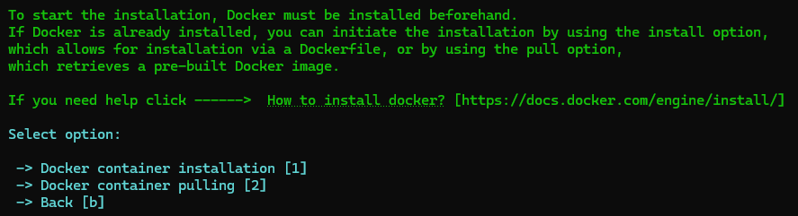
</p>

* #1 - prepare enviroment from a Dockerfile.
* #2 - pull entrie container from DockerHub [recommended].

<br />

If Docker is not running or is not installed, an error will occur:

 <p align="center">

</p>


<br />


### 2. Start application <a id="start"></a>


<p align="center">

</p>

```
#2
```

<br />

 If the application was not installed previously, an error will occur:

 <p align="center">

</p>

<br/>

### 3. Actions in the application <a id="action"></a>


<p align="center">
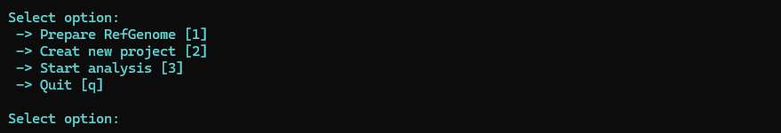
</p>


* #1 – option for preparing reference genomes appropriate for the planned analysis

* #2 – option for creating a new analytical project

* #3 – option for starting the analysis for previously created projects

<br/>

### 3.1 Genome preparing [#1] <a id="genome"></a>


<p align="center">

</p>

Enter species name for downloading reference genome:
* ***human*** - downloading and preparing Homo sapiens genome release GRCh37

```
human
```
* ***mouse*** - downloading and preparing Mus musculus genome release GRCm39
```
mouse
```
* ***custom*** - downloading and preparing cutom genome set in /requirements_file/genome.conf; default custom genome: Schmidtea mediterranea - PRJNA379262
```
custom
```

Users can define different genomes to download and prepare by modifying the genome links in the configuration file -> [genome.conf](requirements_file/genome.conf)

<br />

***genome.conf***

 It is the place where the user can set a basic genome for human and mouse or add a custom genome for analysis, different from the provided options.

```
#!/bin/bash

# Length for extending of UTRs (you can change depending on species) [for mice and human default 3'UTR = 1000 & 5'UTR = 400]
three_prime_utr=1000
five_prim_utr=400
# Optimization options

## UTR extend based on three_prime_utr / five_prim_utr parameters (T - TRUE / F - FASLE)
extend=T

## Separation of names belonging to the one gene name on different place in genomes (chromosome, position) (T - TRUE / F - FASLE)
optimize_names=T
###*if extend=T optimize_names is automatically TRUE

## Separation factor (minimal length between genes with the same name to separate) (default = 150000)
sep_factor=100000

# You can change source of genome [working genome sources: GENECODE, ENSEMBLE, NCBI]. It can be important when genome get update.
# Genome shold be in fa.gz format 
# Annotation file should be in GTF, GFF or GFF3 format

human_genome=https://ftp.ebi.ac.uk/pub/databases/gencode/Gencode_human/release_39/GRCh38.primary_assembly.genome.fa.gz
human_annotation=https://ftp.ebi.ac.uk/pub/databases/gencode/Gencode_human/release_39/gencode.v39.annotation.gtf.gz

mice_genome=https://ftp.ebi.ac.uk/pub/databases/gencode/Gencode_mouse/release_M28/GRCm39.primary_assembly.genome.fa.gz
mice_annotation=https://ftp.ebi.ac.uk/pub/databases/gencode/Gencode_mouse/release_M28/gencode.vM28.annotation.gtf.gz


# You can use also custom genome for other species than human, mouse and both mix
# Belowe eg. Schmidtea_mediterranea genome with annotations

custom_genome=https://ftp.ebi.ac.uk/pub/databases/wormbase/parasite/releases/WBPS16/species/schmidtea_mediterranea/PRJNA379262/schmidtea_mediterranea.PRJNA379262.WBPS16.genomic.fa.gz
custom_annotation=https://ftp.ebi.ac.uk/pub/databases/wormbase/parasite/releases/WBPS16/species/schmidtea_mediterranea/PRJNA379262/schmidtea_mediterranea.PRJNA379262.WBPS16.annotations.gff3.gz


## Quality controle of reads - in some cases of sequencing data quality controle of Read1 which contain UMI and BARCODE can remove most of them due to QC
## In this case you will see in QC-report very low on even 0 reads which passed filtering
## So you can switch off quality controle of reads where adapter trimming and length controle will work
## Default quality controloe of reads is ON

## Quality controle of reads {R1 and R2} (ON/OFF) [default ON]

qc_reads=ON
```
<br>

* ***input*** – an option that allows the user to provide a previously downloaded or prepared genome for preprocessing before analysis.

```
input
```

Before using this option, the directory JSEQ_scRNA_seq/genomes must be created (if it does not already exist). Inside it, create a genome directory with a custom name (JSEQ_scRNA_seq/genomes/<custom_name>) that contains the genome.fa and annotation.gtf files.

***Directory structure***

```
.
├── user_created_directory_with_genome
│   ├── annotation.gtf
│   └── genome.fa

```

<p align="center">
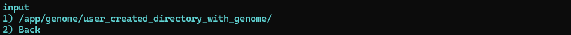
</p>


***Ready genome directory***

```
.
└── human
   ├── annotation.consensus_introns.intervals
    ├── annotation.exons.intervals
    ├── annotation.genes.intervals
    ├── annotation.gtf
    ├── annotation.intergenic.intervals
    ├── annotation.rRNA.intervals
    ├── correct_annotation.gtf
    ├── correct_annotation.refflat
    ├── genome.dict
    ├── genome.fa
    └── index
      └── 150
```

Details about genome annotation refinement - see also description in the [GTF.tool](https://github.com/jkubis96/GTF-tool) repository


<br>
<br>

### 3.2 Project creating [#2] <a id="project"></a>

<p align="center">
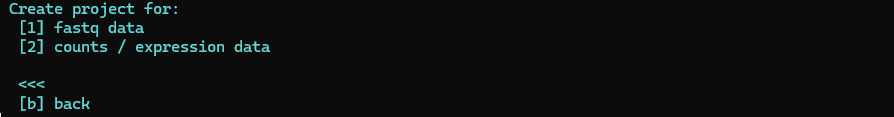
</p>

User can create two type of projects:
* #1 – project for analysis raw data (fastq)

* #2 – project for analysis pre-analysed matrix data (tsv, txt, csv, sparse matrix)


#### 3.2.1 Raw data analysis [#1] <a id="project1"></a>


<p align="center">
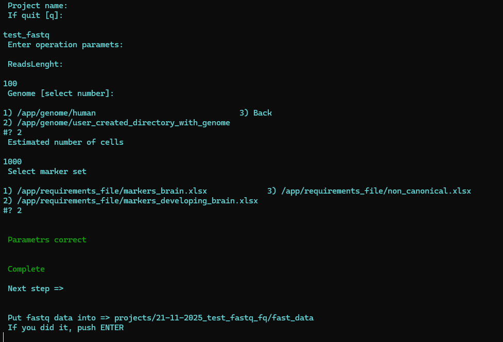
</p>

* ***Project name*** – enter your project name. If it consists of more than one word, use underscores (_) instead of spaces.

* ***Read length*** – specify the read length according to your sequencing technology. If the two read types (Read1 / Read2) have different lengths, provide the length for Read2.

* ***Species*** – enter the name of the species for which the analysis will be performed.

* ***Estimated number of cells*** – indicate the expected number of cells.

* ***Marker set*** – select the appropriate marker set to use in the current analysis.

For more information about markers and naming conventions, see the section on Naming.

***Warnings:*** 

<p align="center">

</p>

If any of the parameters are incorrect, the project will not be created. The user must provide all parameters again in the correct format. 

<p align="center">

</p>


Completing the project requires adding data to the project directory. The data must be in the correct format:
* For a FastQ project, data should be in .fastq format for both Read1 and Read2.
* Multiple files can be provided and will be combined (e.g., 5× Read1_R1.fq and 5× Read2_R2.fq).
* Each read file must include a suffix indicating the read number: _R1 for Read1 and _R2 for Read2.
* Ensure that all Read1 files have the _R1 suffix and all Read2 files have the _R2 suffix.

Failure to follow this format will prevent progression to the next step!


<br/>

#### 3.2.2 Pre-analysed (expression) data analysis [#2] <a id="project2"></a>

<p align="center">
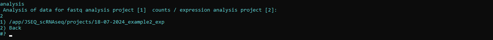
</p>

* ***Project name*** – Enter your project name. If it consists of more than one word, use underscores (_) instead of spaces.

* ***Species*** – Enter the name of the species for which the analysis will be performed.

* ***Marker set*** – Select the appropriate marker set to use in the current analysis.

* ***Data format*** – Select the input data format.

For more information about markers and naming conventions, see the Naming section.

<br />


***Data formats:***
 * ***count matrix*** - matrix of raw counts allowed in *.tsv | *.csv | *.txt formats
* ***normalized expression matrix*** - matrix of normalized data allowed in *.tsv | *.csv | *.txt formats
* ***sparse*** [genes.tsv, barcodes.tsv, matrix.mtx] - separate files for sparse matrix


***Warnings:*** 

<p align="center">

</p>

If any of the parameters are incorrect, the project will not be created. The user must provide all parameters again in the correct format. 

<p align="center">

</p>

Completing the project requires adding data to the project directory. The data must follow the correct format as specified above. Failure to do so will prevent progression to the next step!

<br/>


### 3.3 Perform analysis [#3] <a id="anal"></a>

<p align="center">
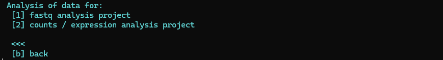
</p>

#### 3.3.1 Raw data analysis [#1] <a id="anal1"></a>

Select the set number to be analyzed

<p align="center">
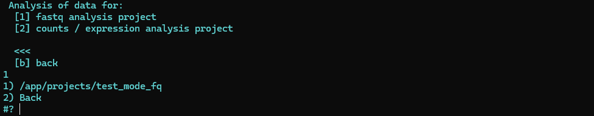
</p>


Analysis progress output

<p align="center">

</p>

Final files -> projects/'project_name'/results

<p align="center">
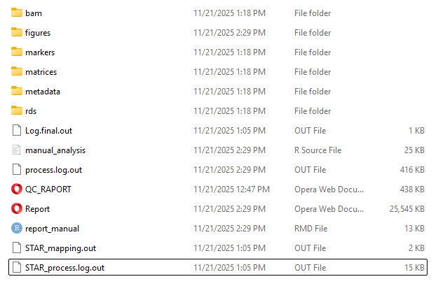
</p>

***Structure:***

```
.
├── Log.final.out
├── QC_RAPORT.html
├── Report.html
├── STAR_mapping.out
├── STAR_process.log.out
├── bam
│   └── Completed.bam
├── figures
│   ├── Cells.svg
│   ├── DropletQC.svg
│   ├── DropletQC_hist.svg
│   ├── Elbow.svg
│   ├── JackStrawPlot.svg
│   ├── PCA_DimPlot_subclasses.svg
│   ├── Ribo~Mito.svg
│   ├── UMAP_DimPlot_subclasses.svg
│   ├── UMAP_clusters.svg
│   ├── UMAP_subtypes.html
│   ├── UMAP_subtypes.svg
│   ├── counts~genes.svg
│   ├── counts~genes_QC.svg
│   ├── expect_whitelist_cell_barcode_counts.png
│   ├── expect_whitelist_cell_barcode_knee.png
│   ├── heatmap_cells_subclasses.svg
│   ├── heatmap_cells_subclasses_scaled.svg
│   ├── heatmap_cells_subtypes.svg
│   ├── heatmap_cells_subtypes_scaled.svg
│   ├── scRNAmetrics.jpeg
│   ├── scRNAmetrics.pdf
│   ├── subclasses_composition.svg
│   ├── subtypes_composition.svg
│   └── variable_genes.svg
├── manual_analysis.R
├── markers
│   ├── CSSG_marker.csv
│   ├── markers_subclasses.csv
│   └── markers_subtypes.csv
├── matrices
│   ├── sparse
│   │   ├── barcodes.tsv
│   │   ├── genes.tsv
│   │   └── matrix.mtx
│   ├── subclasses_average_expression.csv
│   └── sybtypes_average_expression.csv
├── metadata
│   ├── metadata.csv
│   └── scRNAmetrics.txt
├── process.log.out
├── rds
│   └── Results.rds
└── report_manual.Rmd
```
***Output:***

* ***QC_RAPORT.html*** – quality control report for Read 1 and Read 2 sequencing data
* ***Report.html*** – comprehensive report containing the full analysis results
* ***STAR_mapping.out / STAR_process.log.out*** – logs from the STAR mapping analysis
* ***bam/*** – directory containing BAM mapping results
* ***figures/*** – graphs of specific analysis results (*.svg | *.png | *.pdf)
* ***manual_analysis.R*** – script to perform manual analysis
* ***markers/*** – directory containing markers for individual cell subclasses/subtypes (CSSG)
* ***matrices/*** – directories with tabular gene expression results per cell
* ***metadata/*** – metadata containing cell information at different stages of the analysis
* ***process.log.out*** – log containing information about the entire analysis process
* ***rds/*** – directory containing analysis results in Seurat .rds format
* ***report_manual.Rmd*** – scripts for generating a report from the manual analysis

Raport example -> [Report.html](https://jkubis96.github.io/example_reports/Report_example1.html) 


<br/>

#### 3.3.2 Pre-analysed (expression) data analysis [#2] <a id="anal2"></a>

Select the set number to be analyzed

<p align="center">
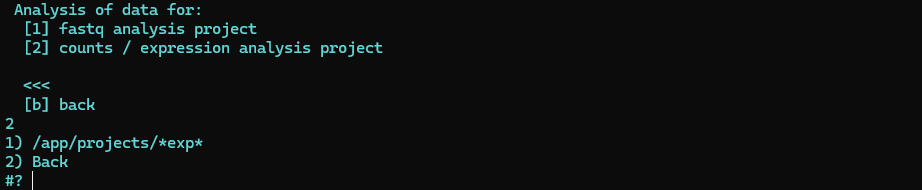
</p>


Analysis progress output

<p align="center">

</p>

Final files -> projects/'project_name'/results

<p align="center">
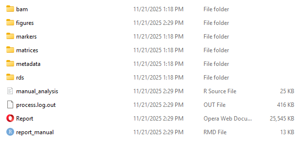
</p>

***Structure:***

```
.
├── Report.html
├── bam
│   └── Completed.bam
├── figures
│   ├── Cells.svg
│   ├── DropletQC.svg
│   ├── DropletQC_hist.svg
│   ├── Elbow.svg
│   ├── JackStrawPlot.svg
│   ├── PCA_DimPlot_subclasses.svg
│   ├── Ribo~Mito.svg
│   ├── UMAP_DimPlot_subclasses.svg
│   ├── UMAP_clusters.svg
│   ├── UMAP_subtypes.html
│   ├── UMAP_subtypes.svg
│   ├── counts~genes.svg
│   ├── counts~genes_QC.svg
│   ├── heatmap_cells_subclasses.svg
│   ├── heatmap_cells_subclasses_scaled.svg
│   ├── heatmap_cells_subtypes.svg
│   ├── heatmap_cells_subtypes_scaled.svg
│   ├── subclasses_composition.svg
│   ├── subtypes_composition.svg
│   └── variable_genes.svg
├── manual_analysis.R
├── markers
│   ├── CSSG_marker.csv
│   ├── markers_subclasses.csv
│   └── markers_subtypes.csv
├── matrices
│   ├── sparse
│   │   ├── barcodes.tsv
│   │   ├── genes.tsv
│   │   └── matrix.mtx
│   ├── subclasses_average_expression.csv
│   └── sybtypes_average_expression.csv
├── metadata
│   └── metadata.csv
├── process.log.out
├── rds
│   └── Results.rds
└── report_manual.Rmd

```
***Output:***


* ***Report.html*** – comprehensive report containing the full analysis results
* ***bam/*** – directory containing BAM mapping results
* ***figures/*** – graphs of specific analysis results (*.svg | *.png | *.pdf)
* ***manual_analysis.R*** – script to perform manual analysis
* ***markers/*** – directory containing markers for individual cell subclasses/subtypes (CSSG)
* ***matrices/*** – directories with tabular gene expression results per cell
* ***metadata/*** – metadata containing cell information at different stages of the analysis
* ***process.log.out*** – log containing information about the entire analysis process
* ***rds/*** – directory containing analysis results in Seurat .rds format
* ***report_manual.Rmd*** – scripts for generating a report from the manual analysis

Raport example -> [Report.html](https://jkubis96.github.io/example_reports/Report_example2.html) 


<br>
<br>

#### 3.3.3 Manual analysis <a id="anal3"></a>

If manual analysis of results is neede, got ot the project directory.

```
cd projects/'project_name'/results
```
There is R script manual_analysis.R

<p align="center">
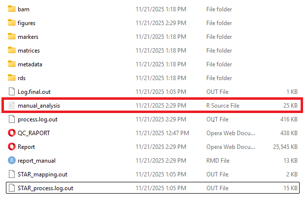
</p>

Run this script and perform analysis on your own.

<p align="center">
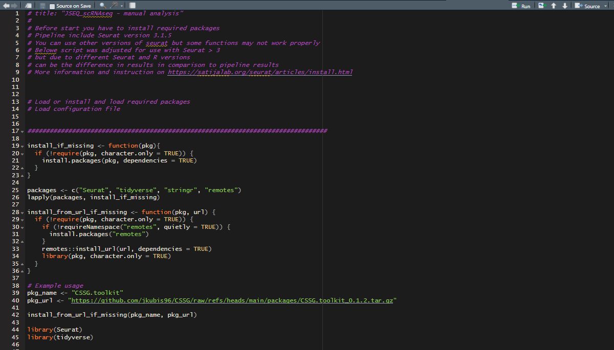
</p>

At the end of analysis you can also generate Report. All results will be save inside project directory in manual_results directory.


***Output:***


<p align="center">

</p>
<br/>
<br/>

### 3.4 Analysis parameters <a id="analpar"></a>

#### 3.4.1 Smart Primer <a id="analpar1"></a>

 ```
cd requirements_file
nano smart_primer
# or use differen text editor
 ```

***smart_primer***
```
smart=AAGCAGTGGTATCAACGCAGAGTAC
```
If your single-cell protocol uses different SMART primers, adjust accordingly; otherwise, leave it unchanged. This will not negatively affect the analysis.

<br/>

#### 3.4.2 Configuration file <a id="analpar2"></a>

 ```
cd requirements_file
nano config_file.conf
# or use differen text editor
 ```

***config_file.conf***

```
# Tresholds
## Percent of mitochondiral genes per cell [default 25%]

mt_per:25

## Down threshold for genes per cell [default NA]

down:NA

## Up threshold for genes per cell [default NA]

up:NA

## Scale factor for normalization

scale_factor:1000000

## Number of variable features to find

n_features:2000

## Clustering resolution

c_res:0.5

#Subtypes markers selection [CSSG]
## Cluster heterogeneity: within-cluster variance or deregulated gene profiles (var / deg) [default deg]

heterogeneity:deg

## Mitochondrial genes in subtype creation (FALSE, TRUE) [default FALSE]

mt_cssg:FALSE

## Markers p_val [default 0.05]

m_val:0.05


## Top markers for naming [default 50]

top_m:50


## Maximum amount of input genes for cluster [default 1000]

max_genes:1000

## Maximum start combination for iteration [default 1000]

max_combine:1000

## Value for nonclassified cells in cluster

loss_val:0.05

## Split factor  (0.2-1) [default 0.8]

s_factor:0.8

## Cell content binary test p-value [default 0.05 - set 0.1 in case of rare subpopulations]

p_bin:0.05

## Drop non-significant subtypes [default TRUE]

drop:TRUE

## Cell content - min cells per subtype

min_c:10
```
The config_file.conf includes parameters necessary for the analysis, allowing users to control threshold settings, explain heterogeneity using the CSSG cell subtypes algorithm, and assess marker importance. It also allows adjustment of hardware usage depending on computational capacity.

<br/> 

#### 3.4.3 Configuration file - tools <a id="analpar2.1"></a>

 ```
cd requirements_file
nano config_tools.conf
# or use differen text editor
 ```

***config_tools.conf***

```
#!/bin/bash

# BARCODE READ

BU_READ=1

# UMI-tools

error_threshold=1

# STAR

outFilterMismatchNmax=10 
outFilterMultimapNmax=10 
outFilterMismatchNoverLmax=0.06
outFilterMismatchNoverReadLmax=0.06
outFilterMatchNmin=20
outFilterScoreMinOverLread=0.33
outFilterMatchNminOverLread=0.33  

# Deep

umi_deep=2500

# DigitalExpression

EDIT_DISTANCE=1
STRAND_STRATEGY=BOTH
OUTPUT_READS_INSTEAD=false
MIN_BC_READ_THRESHOLD=0
```

The config_tools.conf file contains parameters required for the STAR mapping process, as well as separate parameters for defining the minimum UMI depth per cell, the UMI + barcode placement strategy (Read 1 or Read 2), and the mapping strategy.

<br>

#### 3.4.4 Barcodes & UMI <a id="analpar3"></a>

Example of UMI/BARCODE scheme for DropSeq technology:

<p align="center">
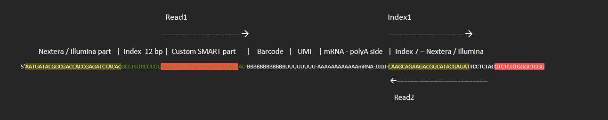
</p>


 ```
cd requirements_file
nano barcodes
# or use differen text editor
 ```


***barcodes***

```
#!/bin/bash

##################################################################################################

## DropSeq library barcodes [Default]

barcode_start=1
barcode_end=12
umi_start=13
umi_end=20


##################################################################################################

## 10x v3 library barcodes

# barcode_start=1
# barcode_end=16
# umi_start=17
# umi_end=28


##################################################################################################

## 10x v2 library barcodes

# barcode_start=1
# barcode_end=16
# umi_start=17
# umi_end=26


##################################################################################################

# RUN:

barcode_length=$[$barcode_end-$barcode_start+1]
umi_length=$[$umi_end-$umi_start+1]

barcode='(?P<cell_1>.{'$barcode_length'})(?P<umi_1>.{'$umi_length'})'
```

Adjust the UMI/BARCODE layout for your analysis based on the technology used e.g., NadiaDolomite / DropSeq | 10xGenomics | etc. Select the appropriate UMI/BARCODE layout and comment out (#) the other options. The default layout is for DropSeq technology.


<br/> 

#### 3.4.5 Adapters <a id="analpar4"></a>

 ```
cd requirements_file
nano Adapters.fa
# or use differen text editor
 ```

***Adapters.fa***

```
>CUSTOM_P5_INDEX_SUFIX
GCCTGTCCGCGG
>P5_INDEX_SEQUENCE
AATGATACGGCGACCACCGAGATCTACACGCCTGTCCGCGG
>P5_INDEX_SEQUENCE_PREFIX
AATGATACGGCGACCACCGAGATCTACAC
>P5_INDEX_SEQUENCE_SUFIX
AAGCAGTGGTATCAACGCAGAGT
>ILLUMINA_UNIVERSAL_READ_SEQUENCE
AGATCGGAAGAG
>CUSTOM_READ_SEQ_REVERSE_COMPLEMENT
GTACTCTGCGTTGATACCACTGCTTCCGCGGACAGGC
>INDEX_NXX7_PREFIX
GTCTCGTGGGCTCGG
>INDEX_NXX7_SUFIX
CAAGCAGAAGACGGCATACGAGAT
>Trans1
TCGTCGGCAGCGTCAGATGTGTATAAGAGACAG
>Trans1_rc
CTGTCTCTTATACACATCTGACGCTGCCGACGA
>Trans2
GTCTCGTGGGCTCGGAGATGTGTATAAGAGACAG
>Trans2_rc
CTGTCTCTTATACACATCTCCGAGCCCACGAGAC
```

 Adapters are part of the sequence necessary for proper sequencing and must be removed before analysis. New sequencing technologies typically remove adapters automatically, but additional quality checks may still be needed. If necessary, add any required adapters for your analysis or modify the existing ones. 

<br/>

### 3.5 Testing mode <a id="test"></a>

 If you’re unsure whether JSEQ_scRNAseq is installed correctly or will run properly on your system, you can use the testing mode.

<br/>

Testing mode includes:
* Genome downloading
* Genome annotation
* Test data downloading
* Test analysis with report creation

<br/>

In main JSEQ_scRNAseq directory run:

 ```
./testing_mode
 ```

<p align="center">
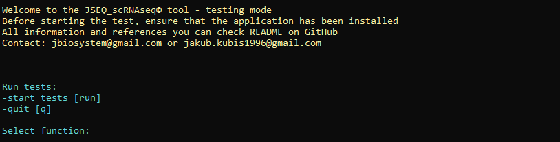
</p>


Run the tests; this can take up to several hours...


```
run
```

<p align="center">

</p>


If everything is okay, the user will see: All tests passed!


A smaller set of tests is also included in GitHub Actions.

<p align="center">
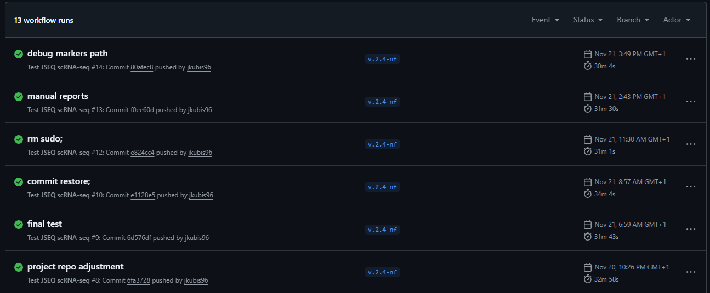
</p>

<br/>


### 4. Additional algorithms <a id="aa"></a>

#### 4.1 GTFtool <a id="aagtf"></a>

GTFtool provides an option for annotation file enrichment, which is connected to the single-cell library structure. Typically, single-cell libraries are created from the 3'UTR side, starting with the polyA tail, followed by the 3'UTR sequence, and then the rest of the transcript. Annotation files do not always include 3' UTR sequence information. To address this, GTFtool includes scripts for extending UTRs, thereby improving the mapping process to genes. Because of variations in library sequence lengths, many sequences may include UTRs, and without UTR information in the annotation file, reads may map to intergenic regions, resulting in the loss of additional count information. You can now choose to extend UTR sequences, and if you do, specify the length to extend for both (if applicable). 


<p align="center">

</p>

<br/>


#### 4.2 Genes per cell - range estimation algorithm <a id="gout"></a>

 An algorithm has been created that searches for the highest upper and lower density of results within the entire spectrum of gene/cell dependencies and sets the lower and upper control ranges for cells with a given expression of genes per cell.

<br>

***Graph presents example threshold on testing data***

<p align="center">

</p>


 The algorithm is used when the values for "down" and "up" in the config_file.conf are set to NA (default setting). Users can set their own thresholds by changing NA to numerical values. The algorithm is important because fixed values often exclude a significant portion of results. For example, if a user sets the lower threshold to 100 genes/cell and 25% of the results have 99 genes/cell, then 25% of the results would be excluded due to a difference of just one gene. 

<br/>

#### 4.3 Component selection algorithm <a id="pca"></a>

An algorithm has been created that checks where the variance in successive principal components does not change significantly and selects the number of principal components sufficient for the overall analysis of single-cell data clustering. 

***Graph (ElbowPlot) presents example threshold for PCs***

<p align="center">
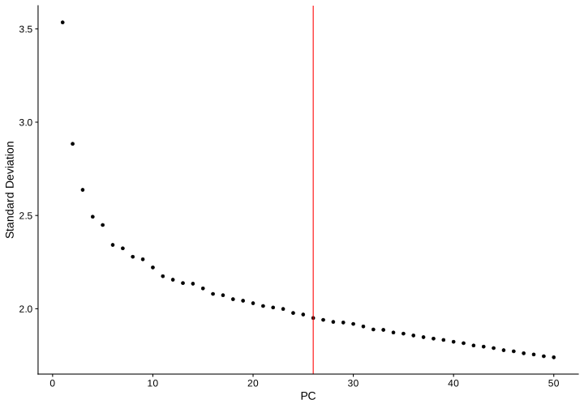
</p>

<br/>


 In this case, the algorithm selected 25 as the appropriate number of PCs for this data set. To verify the correctness of the selected number of PCs, the JackStraw function was used to indicate the statistical significance of individual PCs (p_val = 0.05).


***Graph (JackStraPlot) presents of significient PCs***

<p align="center">

</p>

<br/>


#### 4.4 CSSG (Cell Subtypes Selection by Gene) algorithm <a id="aaCSSG"></a>

The CSSG algorithm allows exploration of the internal heterogeneity within cell clusters. It operates on binary gene × cell matrices in an iterative manner to select optimal gene combinations that fill gaps within the cluster through combinatorial gene patterns. In the next step, the best gene combination is used to subdivide the original cluster into sub-clusters (cell subtypes). This provides insight into both the internal variability of the cluster and global differences across clusters. By doing so, we can better observe variations resulting from metabolic changes, developmental trajectories, functional differences, and cell cycle states. This is particularly important for accurately tracking biological processes, for example under disease conditions or after treatment interventions.

The algorithm works by converting gene expression data into binary form, where a value of ‘1’ indicates the presence and ‘0’ the absence of a gene in each cell. Iterative matching of these binary matrices allows the algorithm to calculate the occurrence of specific gene combinations within the cluster. During each iteration, two types of matrices are generated: the first replicates a single marker gene vector, while the second contains the occurrence information of all marker genes except the one currently under study. Summing these matrices produces all possible combinations of gene occurrences within the cluster.

The algorithm evaluates each combination using statistical measures, including loss_val (value for unexplained cells), ht (heterogeneity factor), and adj_ht (adjusted heterogeneity factor). Iterations continue until conditions are met—either the loss_val reaches a default threshold (e.g., 0.05), or the next gene combination does not improve cluster explanation or reduces heterogeneity. 

Once the optimal combinations are identified, sub-clusters are defined using the dominant expression (max(log(CPM+1))) of the best gene combination based on the adj_ht statistic.

Details in [CSSG.toolkit](https://github.com/jkubis96/CSSG)

<br />

***CSSG scheme***

<br />

<p align="center">
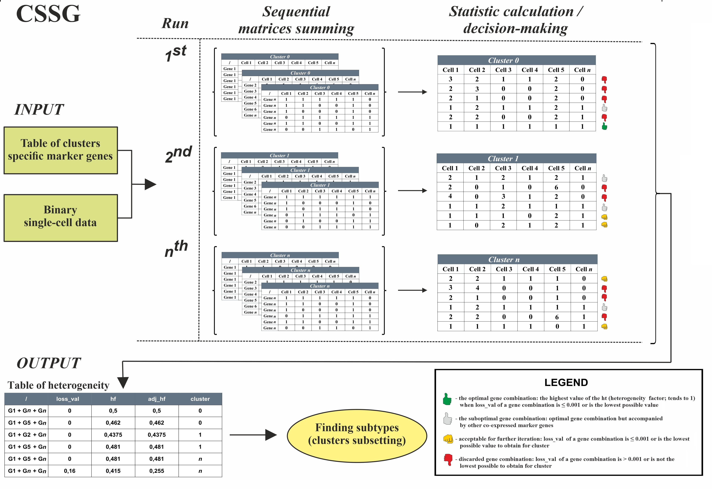
</p>

<br />
<br />


***Example of subclustering using CSSG algorithm***


<br />

<p align="center">

</p>

<br />

<br />


***Heatmap of subtypes with the CSSG markers that were responsible for separating***

<br />

<p align="center">
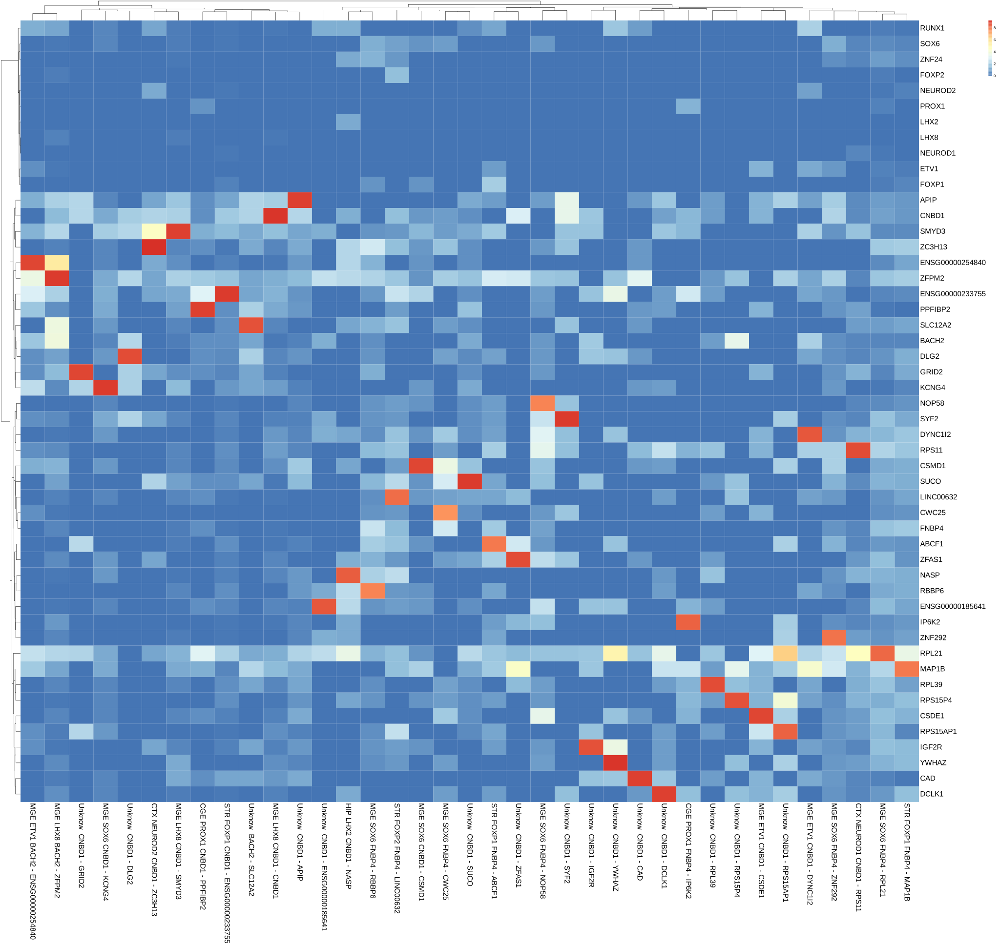
</p>


<br />
<br />


#### 4.5 Cell naming algorithm <a id="aacn"></a>


 A particular Cell Clusters Naming (CCN) algorithm was written for cell naming, which checked the most expressed marker for each cluster. It incluide two types of cell naming: for the user who defined a canonical set of markers for cell population naming – canonical name structure, and for the user who wants only to check the structure of the single-cell data without knowledge about cell populations lineage affiliation and attached to the cell names only automatical selected gene markers - non-canonical name structure.

<br />

<p align="center">

</p>


Canonical approach is based on three types of markers: class markers, subclass markers, and cluster-specific markers selected by MAST. In the first step, the algorithm checks the cell class based on the most expressed class marker (log(CPM+1)) and gives the name to the class. In the following steps, the algorithm gives names for cell subclass and subtypes in the same way. 

<br>

User markers are in the excel file in JSEQ_scRNAseq/requirements_file/markers_.xlsx. We have two types of markers: the first type is in the first sheet (cell class), and the second is in the second sheet (cell subclass).

<br>

***Cell class markers:***

<p align="center">
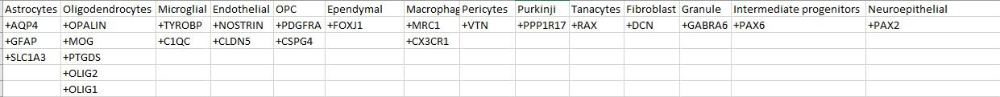
</p>


You can change your markers depending on your data and experiments, but remember if you write your own markers for cell classes, you have to add '+' before the marker gene name. Gene markers without '+' will not be readable. It is an excellent manner to save markers without using them in analysis.

<br>

***Cell subtypes markers:***

<p align="center">

</p>


 In this case, you need not use additional '+' for markers. If you want only class names based on canonical markers, the sheet for the subclass markers should be empty, and then the non-canonical markers for subclass will be set with algorithm. 

Avaiable data sets:

 ```
cd requirements_file
 ```

<p align="center">

</p>

Currently available datasets are for:

* mature brain structures
* developing brain structures
* non-canonical - for non-canonical naming approaches

Users can define their own marker sets in an Excel file and use them during analysis.

Non-canonical approach is based only on cluster information and cluster-specific markers. 

Details in [CSSG.toolkit](https://github.com/jkubis96/CSSG)


<br />


#### 4.6 Removing outlier results - algorithms <a id="out"></a>

 This pipeline contains many checkpoints that protect against lousy quality or badly clustered cells. Even though duplicates removing at the beginning and additional selection points in the pipeline were projected as another quality control step. After dividing cell populations with the CSSG algorithm, obtained cell subtypes in new clusters are checked in terms of proper names. Cell subtypes groups that were poorly marked are renamed to the correct form. Furthermore, when new cell subtypes do not express markers selected by CSSG, they drop out of the analysis. Moreover, the number of cells on the cell subtypes is controlled by the binomial test. If the number of cells is not statistically significant for a given subtype at a level of 0.05, they are excluded from further analysis. 

 Details  in [CSSG.toolkit](https://github.com/jkubis96/CSSG)

<br/>

***Graph presents (red & gray) removed results***

<p align="center">

</p>


<br />


***Graph presents changes in the number of cells throughout the analysis***


<p align="center">

</p>

<br />


### 5. Used techniques <a id="used"></a>

#### 5.1 Ribosomal & mitochondrial gene thresholds <a id="used1"></a>

Depending on the analysis type: single-cell or single-nuclei; the amount of mitochondrial genes per cell should differ. The default value for mitochondrial genes in JSEQ_scRNAseq is up to 20%. There is no threshold for ribosomal genes. The amounts of mitochondrial and ribosomal genes are shown in the results (graphs). Thresholds can be changed in config_file.conf or after running manual_analysis.R 

<br />


***Mitochondrial & Ribosomal genes***

<p align="center">

</p>


<br />

<br />


#### 5.2 Data normalization <a id="used2"></a>

The Seurata Normalize data function with "Log Normalize" normalization, and the scale factor "1e6" (CPM) was used to normalize the data.

***Formula:***
$$
CPM = \frac{\text{count of genes}}{\text{sum of counts per cell}} \times 1000000
$$

$$
\text{NormalizedData} = \log (CPM + 1)
$$

<br />


#### 5.3 Variable features <a id="used3"></a>

To calculate the most variable genes, the 'vst' (Variance Stabilizing Transformation) selection method was used with the 'equal_frequency' method based on the Seurat function FindVariableFeatures. 

<br />

<p align="center">

</p>

<br />


#### 5.4 Dimensionality reduction (PCA) <a id="used4"></a>

Principal components are a method responsible for reducing the dimensionality of 'p' numerical variables for each 'n' element, increasing interpretability without losing significant information (Jolliffe & Cadima, 2016). This method allows us to manage gene expression matrices for a large number of cells. It is very difficult to compare all genes (p) (for example, in humans and mice, it is about 30,000 genes) in all cells (n). By using the PC method, we can obtain only the important statistical information in the form of PCs, which explain the maximum amount of variance in the data set. Principal components were calculated on scaled data (using the ScaleData function) with the most variable features (genes) using the Seurat function RunPCA.

<br />

<p align="center">

</p>


<br />

#### 5.5 Data clustering <a id="used5"></a>

 Data clustering based on previously selected PCs uses two Seurat functions: FindNeighbors and FindClusters. These functions are based on KNN (k-nearest neighbor) with Jaccard distance and SNN (shared nearest neighbor) graph with Louvain modularity optimization. The FindClusters function is set with a resolution of 0.5, the number of starts at 10, and the number of iterations at 1000. Both algorithms are common for single-cell analysis and provide clusters connected with different cell populations (Zhu et al., 2020). In the following steps, based on these clusters, we obtain marker genes for each cluster, name cell populations using known gene markers, and divide cell populations into cell subtypes. 


<br />


#### 5.6 Cluster visualization (UMAP) <a id="used6"></a>

 In contrast to traditional linear dimensionality reduction methods like PCA, UMAP is a non-linear method. The UMAP method, similar to t-SNE, is based on dimensionality reduction and belongs to the non-linear visualization methods. The main role of UMAP algorithms is single-cell data visualization (Narayan et al., 2020). Furthermore, UMAP seems more convenient than the t-SNE method, which can be problematic with large data sets. UMAP optimizes the embedding coordinates of individual data points using iterative algorithms and constructs a high-dimensional graph representation of the data, then optimizes a low-dimensional graph to be as structurally similar as possible.

<br />

<p align="center">

</p>


<br />


### 6. Performance testing <a id="perform"></a>


***Number of cells in testing data***

<p align="center">

</p>

<br/>


#### 6.1 Raw data analysis <a id="perform1"></a>


***Performance statistics:***


<br />


<p align="center">
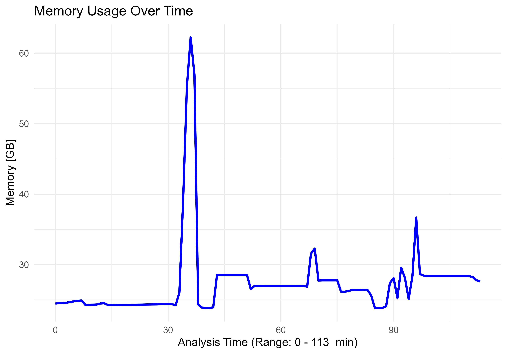
</p>

<br />

<p align="center">
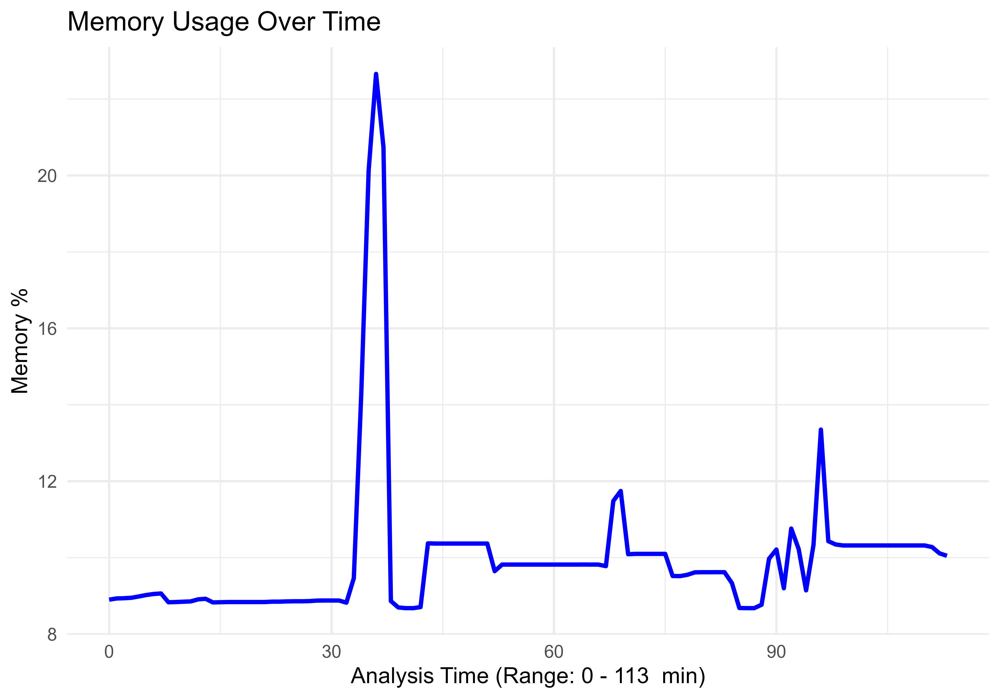
</p>


<br />


<p align="center">

</p>

<br/>


#### 6.2 Pre-analysed (expression) data analysis <a id="perform2"></a>


***Performance statistics:***


<br />


<p align="center">
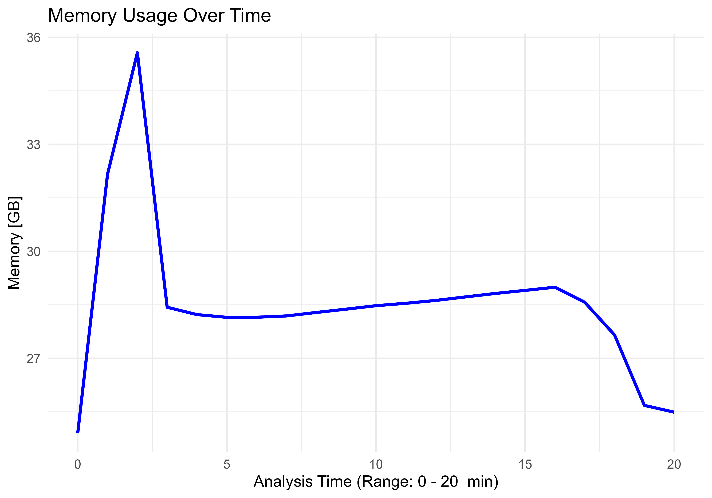
</p>

<br />

<p align="center">

</p>


<br />

<p align="center">
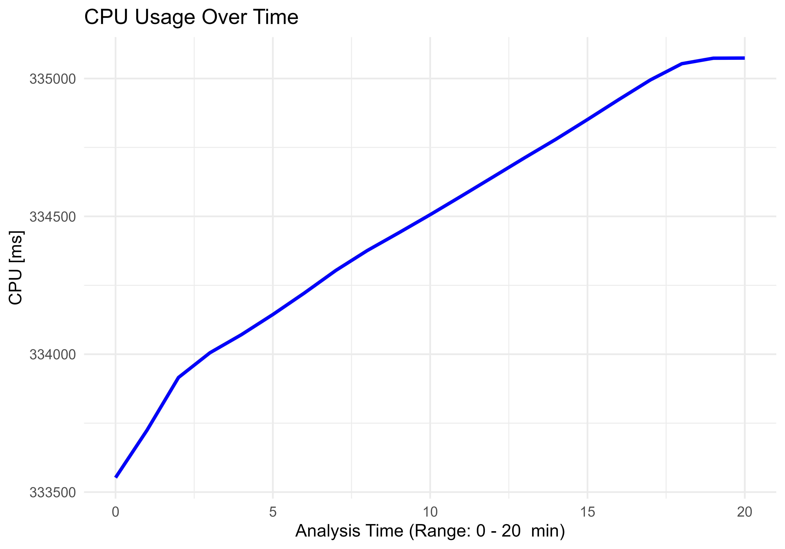
</p>


<br/>


### 7. References <a id="ref"></a>

#### 7.1 Tools and algorithms <a id="ref1"></a>


* [DropSeqPipe](https://github.com/Hoohm/dropSeqPipe)
* [STAR](https://github.com/alexdobin/STAR)
* [Drop-seq](https://github.com/broadinstitute/Drop-seq)
* [fastp](https://github.com/OpenGene/fastp)
* [Seurat](https://github.com/satijalab/seurat)
* [UMI-tools](https://github.com/CGATOxford/UMI-tools)
* [UMAP](https://umap-learn.readthedocs.io/en/latest/)

Other tools and algorithms that are included in the aforementioned programs

<br/>


#### 7.2 Publications <a id="ref2"></a>

* Narayan, A., Berger, B., & Cho, H. (2020). Density-preserving data visualization unveils dynamic patterns of single-cell transcriptomic variability. BioRxiv, 1–50. https://doi.org/10.1101/2020.05.12.077776
* Zhu, X., Zhang, J., Xu, Y., Wang, J., Peng, X., & Li, H. D. (2020). Single-Cell Clustering Based on Shared Nearest Neighbor and Graph Partitioning. Interdisciplinary Sciences: Computational Life Sciences, 12(2), 117–130. https://doi.org/10.1007/s12539-019-00357-4
* Ian T Jolliffe, Jorge Cadima (2016) Principal component analysis: a review and recent developments. Philos Trans A Math Phys Eng Sci, 13;374(2065):20150202. https://doi.org/10.1098/rsta.2015.0202


<br/>
<br/>


### Have fun JBS©